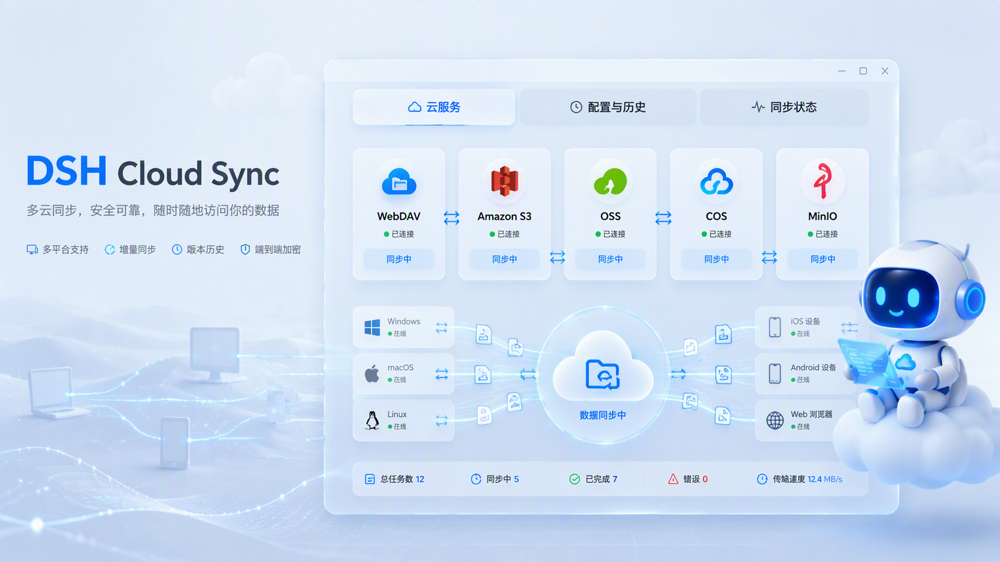
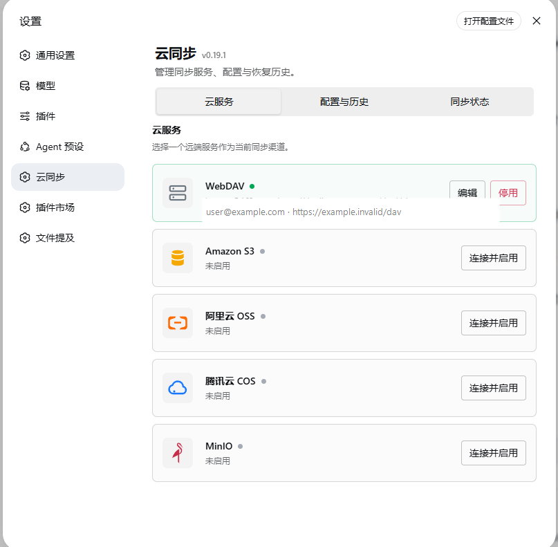
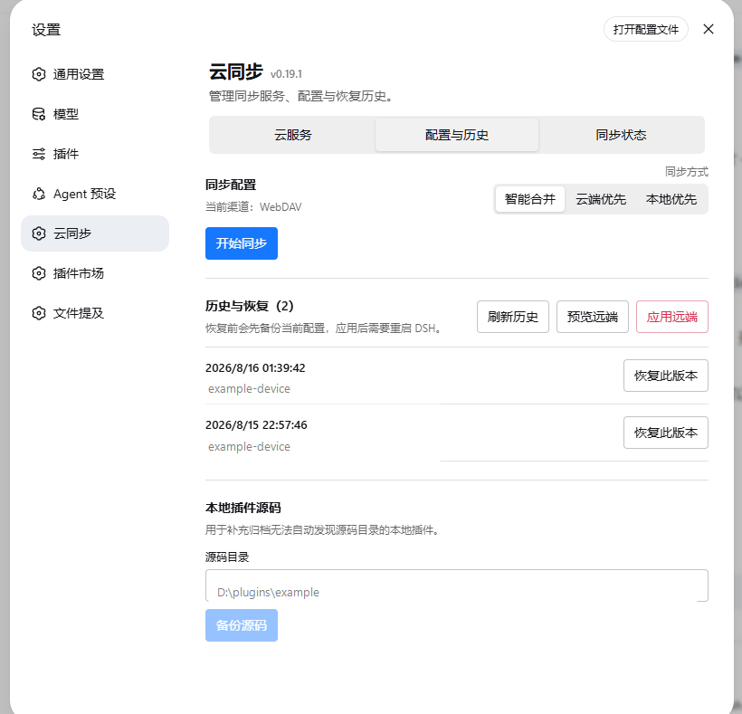
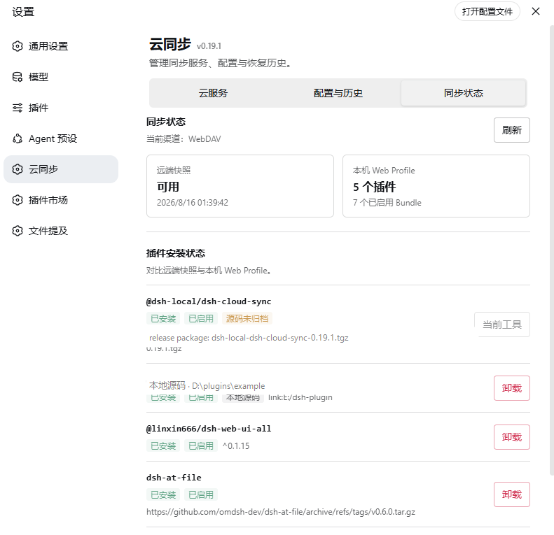
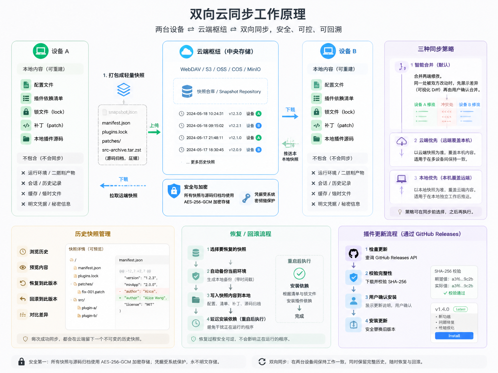

<div align="center">

# DSH Cloud Sync

<p align="center">
  
</p>

**把 DSH 的配置、插件和本地源码，安全地带到每一台设备。**

[](https://github.com/dickpy/dsh-cloud-sync/releases)
[](LICENSE)
[](package.json)
[](https://github.com/dickpy/dsh-cloud-sync/releases)

`@dickpy/dsh-cloud-sync` · WebDAV / Amazon S3 / OSS / COS / MinIO · 快照历史 · 冲突恢复 · GitHub 自更新

[English](README.en.md) · [变更日志](CHANGELOG.md) · [GitHub Releases](https://github.com/dickpy/dsh-cloud-sync/releases) · [问题反馈](https://github.com/dickpy/dsh-cloud-sync/issues)

</div>

---

## 它解决了什么问题？

DSH Cloud Sync 的重点不是绑定某一种存储服务，而是让插件环境可以**随时随地同步**：在办公室、家里或新电脑上，都能用自己顺手的云服务保存配置和插件信息，再快速恢复出一致的 DSH 环境。

它把这件事变成一个清晰的流程：**选择任意支持的云服务，上传可重建的配置和源码归档，把依赖安装交给 DSH / pnpm，在目标设备上恢复出一致的插件环境。**

- 不复制会话、附件、`node_modules`、pnpm 缓存或明文凭据。
- 不绑定某一种云服务：WebDAV、Amazon S3、阿里云 OSS、腾讯云 COS、MinIO 都可以使用。
- 不把更新放在私有 WebDAV：插件本身通过公开 GitHub Releases 检查和安装更新。

## 实际效果

设置页提供三个清晰的工作区：云服务、配置与历史、同步状态。下面是当前版本的实际界面：

<p align="center">
  
  
  
</p>

## 核心能力

| 能力 | 你得到的结果 |
| --- | --- |
| **多云同步渠道** | WebDAV、Amazon S3、阿里云 OSS、腾讯云 COS、MinIO；同一时间只启用一个渠道，切换服务不需要改代码 |
| **轻量可重建快照** | 同步 `package.json`、lockfile、workspace、patch 和市场热更新 YAML，而不是打包整个运行环境 |
| **本地源码归档** | 自动发现可达的 `file:` / `link:` 插件源码，归档后换盘符、换电脑也能恢复 |
| **三种同步策略** | 智能合并、云端优先、本地优先；两端同时修改同一项时先展示差异再执行 |
| **历史与恢复** | 每次成功同步留下快照，支持预览、恢复远端版本和回滚到指定历史版本 |
| **插件安装状态** | 对比远端快照与本机 Web Profile，直接安装或卸载缺失插件 |
| **GitHub 自更新** | 从 GitHub Releases 检查更新，下载 `.tgz` 后校验 SHA-256，再由用户确认安装 |
| **兼容加密和自动同步** | 保留已有 AES-256-GCM、设备名和定时同步配置；界面只保留更容易理解的核心操作 |

## 工作方式

下面这张图展示了双向同步的完整链路：两台设备围绕云端快照仓库同步，保留历史、支持回滚，并可按智能合并、云端优先或本地优先执行。

<p align="center">
  
</p>

目标设备只需要相同的同步渠道和 DSH profile。恢复会先备份当前 profile，再写入快照；依赖安装等到完全重启 DSH 后执行，避免覆盖正在运行的 bundle。

## 快速开始

按推荐顺序，任选一种方式安装；无论哪种方式，安装完成后都需要**完全退出并重启 DSH Web**，然后在 **设置 → 云同步** 中开始配置。

### 方式一：让 AI 助手帮你安装（最省事）

把下面这段话发给 DSH 或 Codex，让它执行安装并重启 DSH Web：

> 请帮我安装 DSH Cloud Sync 插件（npm 包 `@dickpy/dsh-cloud-sync`），然后重启 DSH Web。

### 方式二：通过 npm 安装（推荐）

```powershell
dsh plugin --profile web add @dickpy/dsh-cloud-sync@0.19.2
```

### 方式三：通过聚合包（.tgz）安装

从 [GitHub Releases](https://github.com/dickpy/dsh-cloud-sync/releases/latest) 下载最新的 `dickpy-dsh-cloud-sync-*.tgz`，然后执行：

```powershell
dsh plugin --profile web add .\dickpy-dsh-cloud-sync-0.19.2.tgz
```

适合无法直接访问 npm registry 的内网或离线环境。

### 方式四：自己开发启动

```powershell
git clone https://github.com/dickpy/dsh-cloud-sync.git
cd dsh-cloud-sync
npm install
npm run check
dsh plugin --profile web add .
```

适合需要修改插件源码、调试或贡献代码的场景。

### 第一次同步

1. 打开 **云服务**，选择 WebDAV、S3、OSS、COS 或 MinIO，填写对应的 Endpoint、Bucket 和凭据。
2. 进入 **配置与历史**，选择同步策略并点击 **开始同步**。
3. 需要手动补充本地插件源码时，在同一页填写源码目录并点击 **备份源码**。
4. 换到新设备后，在 **同步状态** 查看插件安装情况；可先预览远端快照，再应用恢复。

> 同一时间只有一个同步渠道处于启用状态。连接并启用新的渠道时，旧渠道会自动停用。

## 支持的同步渠道

| 渠道 | 适合场景 | 配置要点 |
| --- | --- | --- |
| **WebDAV** | 坚果云、Nextcloud、NAS 等 | 填写 DAV 地址、用户名和应用密码 |
| **Amazon S3** | AWS 或兼容 S3 的对象存储 | Endpoint、Region、Bucket、Access Key |
| **阿里云 OSS** | 阿里云对象存储 | 使用 OSS 的 S3 兼容 Endpoint |
| **腾讯云 COS** | 腾讯云对象存储 | Bucket 通常包含 APPID，填写对应 Region |
| **MinIO** | 自建对象存储、内网或本地开发 | 填写 MinIO Endpoint、Bucket 和密钥 |

公共网络上的存储服务建议使用 HTTPS。MinIO 在本机或可信内网中可以使用 HTTP。

## 同步策略

| 策略 | 行为 |
| --- | --- |
| **智能合并（默认）** | 合并两端的插件依赖、Bundle 和源码归档；发现同一项目被两端修改时，先让你确认 |
| **云端优先** | 使用远端快照覆盖当前 profile，适合新设备恢复 |
| **本地优先** | 使用当前 profile 覆盖远端快照，适合把本机状态作为最新版本 |

## 安全边界

- 快照、历史和源码归档可使用 AES-256-GCM 客户端加密；每个对象使用新的 KDF salt。
- 密码和派生密钥不会写入明文设置文件；Windows 使用当前用户 DPAPI 保护已保存凭据。
- 恢复前自动备份当前 profile，源码归档恢复会做 SHA-256 校验并拒绝路径穿越。
- 加密保护的是远端内容，不替代对象存储本身的权限控制；请为 Bucket、Endpoint 和 MinIO 管理员账号配置最小权限。

## GitHub 自更新

打开云同步设置页时，插件会直接检查 [GitHub Releases](https://github.com/dickpy/dsh-cloud-sync/releases)，不依赖任何 WebDAV 或对象存储配置。发现新版本后：

1. 用户点击 **更新**；
2. 插件下载对应的 `.tgz` 到本机 release 缓存；
3. 使用 GitHub 提供的 SHA-256 资产摘要校验；
4. 用户确认后安装到 `web` profile，重启 DSH 完成切换。

更新始终是显式操作，不会在同步时静默替换正在运行的 Cloud Sync。

## 开发与测试

环境要求：Node.js 18 或更高版本、pnpm。

```powershell
npm install
npm run check
npm test
npm pack
```

项目结构：

```text
lib/index.js       bundle 入口和本地 API 路由
lib/core.js        存储渠道、快照、加密和插件生命周期
lib/client.js      设置页 UI
test/core.test.mjs 核心流程集成测试
docs/screenshots/  README 界面截图
```

## 发布

1. 更新 `package.json` 版本号并添加 `CHANGELOG.md` 条目；
2. 执行 `npm run check` 和 `npm test`；
3. 执行 `npm pack` 生成 `.tgz`；
4. 创建同版本的 GitHub Release 并上传 `.tgz`；
5. 其他设备会在设置页检测到更新，并由用户显式安装。

## 常见问题

**没有 WebDAV，也能检查插件更新吗？**

可以。插件更新来自 GitHub Releases，与同步渠道完全独立；WebDAV、S3、OSS、COS、MinIO 只负责你的配置快照和源码归档。

**会不会复制整个 `node_modules`？**

不会。同步的是可重建的 profile 文件和必要的本地插件源码，依赖由目标设备上的 DSH / pnpm 重新安装。

**为什么恢复后要重启 DSH？**

恢复会修改 profile 配置。重启可以让 pnpm 和 DSH 从新的 profile 重新建立依赖，避免在运行中的 bundle 上热替换。

**如何排除不想同步的文件？**

在 DSH 同步目录创建 `.dshsyncignore`，每行填写一个要排除的文件或目录名。

## 许可证

[MIT](LICENSE) © 2025 dickpy
